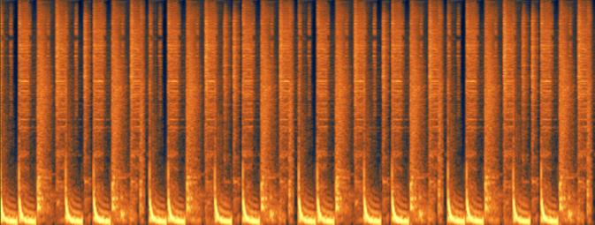
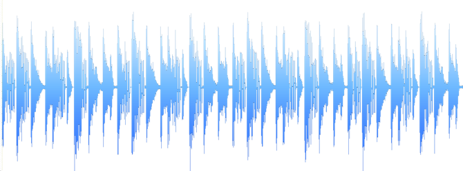
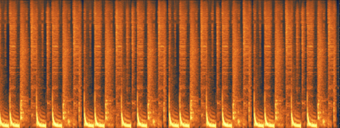
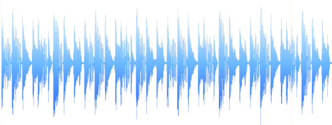

# py-stego-phase

Метод фазового кодирования в аудио стеганографии.

## Оглавление

- [Метод фазового кодирования](#метод-фазового-кодирования)
- [Пример работы программы](#пример-работы-программы)
- [Литература](#литература)
- [Лицензия](#лицензия)


## Метод фазового кодирования

Процедура фазового кодирования:

1. Звуковая последовательность разбивается на серию `N` коротких сегментов.

2. К `n`-ому сегменту сигнала применяется `K`-точечное ДПФ, где `K = I/N`, `I` – длина дискретных значений сигнала, и создаются массивы фаз и амплитуд.

3. Запоминается разность фаз между каждыми соседними сегментами.

4. Двоичная последовательность данных представляется как π/2 или -π/2, отображая соответственно, 1 или 0.

5. С учетом разности фаз воссоздается массив фаз. 

6. Восстановление звукового сигнала осуществляется путем применения операции обратного ДПФ к исходной матрице амплитуд и модифицированной матрице фаз.

Для снижения уровня искажения в реализованном методе применялись следующие приёмы:

* При формировании новых фаз внесение скрываемых данных начинается с высокочастотных составляющих.

* Крайние сегменты остаются неизменными

## Пример работы программы

Имеем сигнал с частотой дискретизации 44100 Гц, 16 битами в выборке и 1 каналом. Длительность сигнала составляет 9 сек.

Спектральная и временная диаграммы оригинального сигнала:




Скроем следующее сообщение:

> There is nothing more than math!

```
$ python stego_phase.py -i "wav/beat.wav" -m "msg/msg.txt" -o "wav/stego.wav"    
reading wave container... 
preparing container...	
performing fft transform...
msg integration...
saving stego container...
Done.
Remember segment width to recover message: 1024
```

Спектральная и временная диаграммы сигнала с скрытым сообщением:




Модифицированный аудио контейнер не отличим от исходного. Модификация фазы осуществлялась для сохранения сообщения длинной 248 бит при неизменной длине сегмента в 1024 бита. При увеличении длины сообщения при той же длине сегмента, будет ощущаться небольшое потрескивание, что характеризует недопустимое изменение фазы.
Для восстановления сообщения воспользуемся командой:

```
$ python stego_phase.py -i "wav/stego.wav" -m "msg/msg_recovered.txt" --karg 1024
reading wave container...
preparing container...
performing fft transform...
recovering message...
Done.
```

Для более точного анализа можно воспользоваться [программой](https://github.com/Galarius/gs-analyzator) для расчёта разностных и корреляционных показателей искажения.

---

*Графики были получены в программе iZotope Rx*

## Литература

1. Г.Ф. Конахович, А.Ю. Пузыренко, «Компьютерная стеганография Теория и практика», «МК- Пресс», Киев, 2006.

## Лицензия

<a rel="license" href="http://creativecommons.org/licenses/by-nc-nd/4.0/"></a>

Исходный код «py-stego-phase» выложен на условиях [GNU GPLv3](https://choosealicense.com/licenses/gpl-3.0/#)